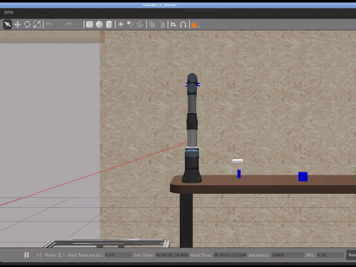
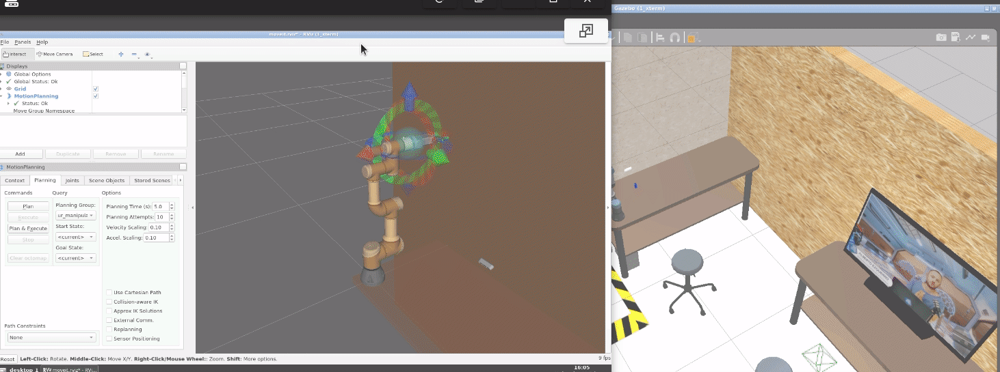

# Checkpoint 13 - Manipulation Basics

ROS 2 manipulation stack that drives a **Universal Robots UR3e** arm with a **Robotiq 85** gripper through a complete **Pick & Place** pipeline using the **MoveIt2 C++ `MoveGroupInterface` API**. A MoveIt2 configuration package is generated with the Setup Assistant and a C++ node orchestrates the full sequence (home → pregrasp → approach → grasp → retreat → place → release → home) using a mix of joint-value targets, pose targets and Cartesian waypoints. Developed and validated in the simulated warehouse environment (`the_construct_office_gazebo/warehouse_ur3e.launch.xml`).

<p align="center">
  
</p>

## How It Works

<p align="center">
  
</p>

### MoveIt2 Configuration Phase

1. `MoveIt Setup Assistant` is run against `ur.urdf.xacro` from `universal_robot_ros2/Universal_Robots_ROS2_Description`
2. Two planning groups are defined in the SRDF: `ur_manipulator` (chain `base_link` → `tool0`) and `gripper` (Robotiq 85 joints)
3. Named states: `home` for the arm, `open` / `close` for the gripper
4. `hand_ee` end effector links the `gripper` group to `wrist_3_link`
5. The generated package exposes `move_group.launch.py` and `moveit_rviz.launch.py` for Plan & Execute from RViz2

### Pick & Place Execution Phase

1. A `move_group_node` is spawned with `automatically_declare_parameters_from_overrides(true)` and spun on a detached thread via a `SingleThreadedExecutor`
2. Two `MoveGroupInterface` handles are created — one for `ur_manipulator`, one for `gripper`
3. Kinematic planning (`plan_trajectory_kinematics`) drives joint-value and pose targets through OMPL
4. Cartesian planning (`plan_trajectory_cartesian`) drives straight-line approach/retreat via `computeCartesianPath` (`eef_step = 0.01 m`, `jump_threshold = 0.0`)
5. Gripper actions (`plan_trajectory_gripper`) dispatch the SRDF-named `open` / `close` states
6. Each stage logs to the `move_group_node` logger and sleeps 1 s between motions to let the controllers settle

## Tasks Breakdown

### Task 1 - Configure the MoveIt2 Package (`my_moveit_config`)

- Generated with the **MoveIt Setup Assistant** from `~/ros2_ws/src/universal_robot_ros2/Universal_Robots_ROS2_Description/urdf/ur.urdf.xacro`
- SRDF planning groups: `ur_manipulator` (chain `base_link` → `tool0`), `gripper` (Robotiq 85 joint set)
- Named states:
  - `home` (arm): `shoulder_pan=0`, `shoulder_lift=-2.5`, `elbow=1.5`, `wrist_1=-1.5`, `wrist_2=-1.55`, `wrist_3=0`
  - `open` (gripper): `robotiq_85_left_knuckle_joint = 0.000`
  - `close` (gripper): `robotiq_85_left_knuckle_joint = 0.650`
- End effector `hand_ee` parented to `wrist_3_link` with `gripper` as its group
- Collision matrix auto-generated (disables 70+ adjacent/default/never-colliding pairs)
- Controllers wired through `moveit_controllers.yaml`:
  `joint_trajectory_controller`, `joint_state_broadcaster`, `gripper_controller`
- `kinematics.yaml`, `joint_limits.yaml`, `pilz_cartesian_limits.yaml` configured from the URDF defaults
- `moveit.rviz` preset with RobotModel, MotionPlanning, TF and PlanningScene displays
- Plan & Execute validated from the RViz Motion Planning panel (arm + gripper)

### Task 2 - Real Robot Configuration (`real_moveit_config`)

- Twin MoveIt2 package mirroring `my_moveit_config` (same SRDF groups, named states and controllers)
- Intended to be launched against the real UR3e with `use_sim_time:=False`
- Cube position in the real environment relative to `base_link`:
  `target_pose.position.x = 0.343`, `target_pose.position.y = 0.132`
- Real-robot runs were not the focus of this repository — the validated deliverable is the simulation pipeline

### Task 3 - Pick & Place Node (`moveit2_scripts/pick_and_place.cpp`)

- Single C++ class `PickAndPlaceTrajectory` wrapping two `MoveGroupInterface` handles
- Dedicated `move_group_node` spun on a detached thread via `SingleThreadedExecutor` so MoveIt can query `/joint_states` and the planning scene while `main()` drives the sequence
- Three planning helpers: kinematic (OMPL), Cartesian (`computeCartesianPath`), gripper (named states)
- Executed sequence:

  | # | Stage            | Target type         | Target                                                                                 |
  |---|------------------|---------------------|----------------------------------------------------------------------------------------|
  | 1 | Home             | Joint values        | `(0.0, -2.5, 1.5, -1.5, -1.5, 0.0)`                                                     |
  | 2 | Pregrasp         | Joint values        | `(-2.8075, -1.6956, -1.7875, -1.2293, 1.5703, -1.2365)`                                 |
  | 3 | Open gripper     | Named gripper state | `open`                                                                                 |
  | 4 | Approach (down)  | Cartesian waypoint  | `Δz = -0.060 m`                                                                         |
  | 5 | Close gripper    | Named gripper state | `close`                                                                                |
  | 6 | Retreat (up)     | Cartesian waypoint  | `Δz = +0.060 m`                                                                         |
  | 7 | Place pose       | Joint values        | `(0.0, -1.6956, -1.7875, -1.2293, 1.5703, -1.2365)` (shoulder rotated 180° from pregrasp) |
  | 8 | Release          | Named gripper state | `open`                                                                                 |
  | 9 | Return Home      | Joint values        | same as step 1                                                                          |

- Launch file `pick_and_place.launch.py` uses `MoveItConfigsBuilder("name", package_name="my_moveit_config")` and passes `robot_description`, `robot_description_semantic`, `robot_description_kinematics` and `use_sim_time: True` to the node

## ROS 2 Interface

| Name | Type | Description |
|---|---|---|
| `/joint_states` | `sensor_msgs/JointState` (sub) | Arm + gripper joint positions |
| `/joint_trajectory_controller/follow_joint_trajectory` | `control_msgs/FollowJointTrajectory` (action) | Arm trajectory execution |
| `/gripper_controller/gripper_cmd` | `control_msgs/GripperCommand` (action) | Gripper open/close commands |
| `/move_action` | `moveit_msgs/MoveGroup` (action) | MoveIt2 planning + execution action |
| `/compute_cartesian_path` | `moveit_msgs/GetCartesianPath` (service) | Cartesian path computation (approach/retreat) |
| `/planning_scene` | `moveit_msgs/PlanningScene` (pub) | Active planning scene |
| `world` → `base_link` → ... → `tool0` | TF tree | UR3e kinematic chain |

## Project Structure

```
manipulation_project/
├── my_moveit_config/               # Task 1: MoveIt2 config for simulated UR3e
│   ├── launch/
│   │   ├── move_group.launch.py
│   │   ├── moveit_rviz.launch.py
│   │   ├── demo.launch.py
│   │   ├── rsp.launch.py
│   │   ├── setup_assistant.launch.py
│   │   ├── spawn_controllers.launch.py
│   │   ├── static_virtual_joint_tfs.launch.py
│   │   └── warehouse_db.launch.py
│   └── config/
│       ├── name.srdf               # Planning groups, named states, collision matrix
│       ├── kinematics.yaml
│       ├── joint_limits.yaml
│       ├── pilz_cartesian_limits.yaml
│       ├── moveit_controllers.yaml
│       └── moveit.rviz
├── real_moveit_config/             # Task 2: Twin config for real UR3e
│   ├── launch/                     # (same files as my_moveit_config)
│   └── config/                     # (same files as my_moveit_config)
├── moveit2_scripts/                # Task 3: Pick & Place C++ node
│   ├── src/
│   │   ├── pick_and_place.cpp              # Simulation target
│   │   ├── pick_and_place_real.cpp
│   │   ├── pick_and_place_perception.cpp
│   │   └── pick_and_place_perception_real.cpp
│   ├── launch/
│   │   ├── pick_and_place.launch.py
│   │   ├── pick_and_place_real.launch.py
│   │   ├── pick_and_place_perception.launch.py
│   │   └── pick_and_place_perception_real.launch.py
│   ├── CMakeLists.txt
│   └── package.xml
├── object_detection/               # Perception package for the *_perception* executables
├── custom_msgs/                    # Custom interfaces consumed by perception nodes
└── media/
```

## How to Use

### Prerequisites

- ROS 2 Humble
- MoveIt2 (`moveit_ros_planning_interface`, `moveit_configs_utils`)
- Gazebo Classic 11
- `universal_robot_ros2` (UR description + drivers)
- `the_construct_office_gazebo` (warehouse simulation)

### Build

```bash
cd ~/ros2_ws
colcon build --symlink-install
source install/setup.bash
```

### Simulation — Full Pick & Place

```bash
# Terminal 1 - Gazebo warehouse + UR3e
ros2 launch the_construct_office_gazebo warehouse_ur3e.launch.xml

# Terminal 2 - MoveIt2 move_group
ros2 launch my_moveit_config move_group.launch.py

# Terminal 3 - RViz2 (MoveIt Motion Planning panel)
ros2 launch my_moveit_config moveit_rviz.launch.py

# Terminal 4 - Pick & Place node
ros2 launch moveit2_scripts pick_and_place.launch.py
```

### Sanity checks

```bash
# All three controllers must be active
ros2 control list_controllers
# joint_trajectory_controller  ... active
# joint_state_broadcaster      ... active
# gripper_controller           ... active

# Joint states must be published
ros2 topic echo /joint_states
```

## Key Concepts Covered

- **MoveIt Setup Assistant**: URDF ingestion, SRDF generation, planning groups, named states, collision matrix, end effectors, controllers
- **MoveIt2 C++ API**: `MoveGroupInterface`, `PlanningSceneInterface`, `JointModelGroup`, `RobotState`
- **Planning pipelines**: OMPL kinematic planning vs. `computeCartesianPath` straight-line motion
- **Target types**: joint-value target (`setJointValueTarget`), pose target (`setPoseTarget`), named target (`setNamedTarget`)
- **Multi-group coordination**: separate `ur_manipulator` and `gripper` interfaces orchestrated from the same node
- **Executor threading**: detached `SingleThreadedExecutor` to spin the move_group node while the main thread runs the sequence
- **Controllers**: `joint_trajectory_controller`, `gripper_controller`, `joint_state_broadcaster` wired through `moveit_controllers.yaml`
- **Sim vs. real parity**: twin MoveIt2 configs (`my_moveit_config` / `real_moveit_config`) + twin executables (`pick_and_place` / `pick_and_place_real`)

## Technologies

- ROS 2 Humble
- MoveIt2 (`moveit_ros_planning_interface`, `moveit_configs_utils`, `moveit_msgs`)
- OMPL (default MoveIt2 planner)
- Universal Robots UR3e + Robotiq 85 gripper
- Gazebo Classic 11
- C++ 17 / Python 3
