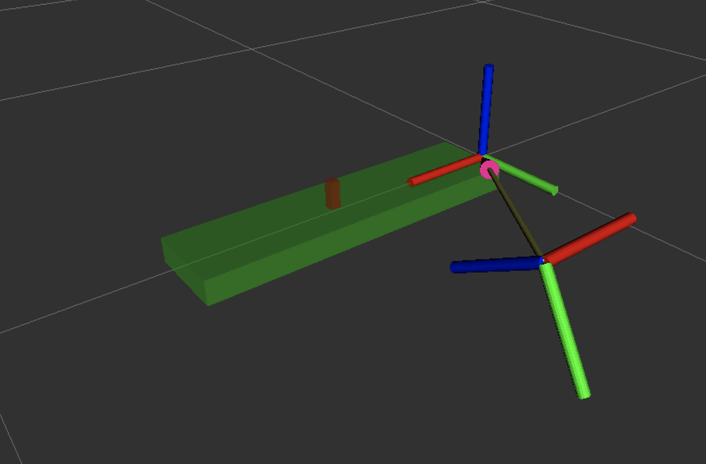

# Checkpoints 13 & 14 - Manipulation & Perception Basics

ROS 2 manipulation stack that drives a **Universal Robots UR3e** arm with a **Robotiq 85** gripper through a complete **Pick & Place** pipeline using the **MoveIt2 C++ `MoveGroupInterface` API**, and upgrades it with a **perception layer** that detects the target object from the wrist depth camera's point cloud.

**Checkpoint 13** builds the MoveIt2 config (`my_moveit_config`) and a hardcoded pick-and-place C++ node (`moveit2_scripts/pick_and_place.cpp`). **Checkpoint 14** adds an `object_detection` Python package that segments the `/wrist_rgbd_depth_sensor/points` cloud into table + object clusters (PCL RANSAC plane + Euclidean clustering), publishes a `DetectedObjects` message, and feeds the detected `(x, y, z)` into a new `pick_and_place_perception.cpp` so the grasp target is obtained from perception instead of being hardcoded.

Developed and validated in the simulated warehouse environment (`the_construct_office_gazebo/warehouse_ur3e.launch.xml`).

<p align="center">
  
</p>

## How It Works

<p align="center">
  
</p>

### MoveIt2 Configuration Phase (CP13)

1. `MoveIt Setup Assistant` is run against `ur.urdf.xacro` from `universal_robot_ros2/Universal_Robots_ROS2_Description`
2. Two planning groups are defined in the SRDF: `ur_manipulator` (chain `base_link` → `tool0`) and `gripper` (Robotiq 85 joints)
3. Named states: `home` for the arm, `open` / `close` for the gripper
4. `hand_ee` end effector links the `gripper` group to `wrist_3_link`
5. The generated package exposes `move_group.launch.py` and `moveit_rviz.launch.py` for Plan & Execute from RViz2

<p align="center">
  
</p>

### Perception Phase (CP14)

1. Wrist RGB-D camera publishes a `sensor_msgs/PointCloud2` on `/wrist_rgbd_depth_sensor/points`
2. A static TF `base_link` → `wrist_rgbd_camera_depth_optical_frame` is broadcast (translation `(0.338, 0.450, 0.100)`, rotation `(0, 0.866, -0.5, 0)` — aligns the camera frame to the arm base)
3. The cloud is transformed into `base_link` and converted to a `pcl.PointCloud` (quaternion → rotation matrix applied per point)
4. Two filtered clouds are produced:
   - Plane cloud: `x ≤ 0.5`, `-0.05 ≤ z ≤ 0.1` (table surface)
   - Object cloud: `x ≤ 0.5`, `0.00 ≤ z ≤ 0.1` (objects on top of the table)
5. RANSAC plane segmentation (`SACMODEL_PLANE`, `distance_threshold = 0.01 m`) extracts the table
6. Euclidean clustering (`ClusterTolerance = 0.02 m`, `MinClusterSize = 100`, `MaxClusterSize = 80000`) is run on both clouds to pull out cube-like blobs
7. Each cluster → centroid + bounding-box dimensions
8. Results are published as `MarkerArray`s (green cube for the surface, red cube for the object) and as `DetectedSurfaces` / `DetectedObjects` custom messages

### Pick & Place Execution Phase (CP13, upgraded in CP14)

1. A `move_group_node` is spawned with `automatically_declare_parameters_from_overrides(true)` and spun on a detached thread via a `SingleThreadedExecutor`
2. Two `MoveGroupInterface` handles are created — one for `ur_manipulator`, one for `gripper`
3. `pick_and_place_perception` subscribes to `/object_detected` and blocks up to 10 s waiting for the first detection
4. Pregrasp pose is built from the detection: `(object_x + 0.012, object_y - 0.012, object_z + 0.20)` with a downward-facing orientation quaternion
5. Kinematic planning (`plan_trajectory_kinematics`) drives joint-value and pose targets through OMPL
6. Cartesian planning (`plan_trajectory_cartesian`) drives straight-line approach/retreat via `computeCartesianPath` (`eef_step = 0.01 m`, `jump_threshold = 0.0`)
7. Gripper actions (`plan_trajectory_gripper`) dispatch the SRDF-named `open` / `close` states
8. Each stage logs to the `move_group_node` logger and sleeps 1 s between motions to let the controllers settle

## Tasks Breakdown

### CP13 Task 1 - MoveIt2 Configuration (`my_moveit_config`)

- Generated with the **MoveIt Setup Assistant** from `~/ros2_ws/src/universal_robot_ros2/Universal_Robots_ROS2_Description/urdf/ur.urdf.xacro`
- SRDF planning groups: `ur_manipulator` (chain `base_link` → `tool0`), `gripper` (Robotiq 85 joint set)
- Named states:
  - `home` (arm): `shoulder_pan=0`, `shoulder_lift=-2.5`, `elbow=1.5`, `wrist_1=-1.5`, `wrist_2=-1.55`, `wrist_3=0`
  - `open` (gripper): `robotiq_85_left_knuckle_joint = 0.000`
  - `close` (gripper): `robotiq_85_left_knuckle_joint = 0.650`
- End effector `hand_ee` parented to `wrist_3_link` with `gripper` as its group
- Collision matrix auto-generated (disables 70+ adjacent/default/never-colliding pairs)
- Controllers wired through `moveit_controllers.yaml`: `joint_trajectory_controller`, `joint_state_broadcaster`, `gripper_controller`
- `kinematics.yaml`, `joint_limits.yaml`, `pilz_cartesian_limits.yaml` configured from the URDF defaults
- `moveit.rviz` preset with RobotModel, MotionPlanning, TF and PlanningScene displays
- Plan & Execute validated from the RViz Motion Planning panel (arm + gripper)

### CP13 Task 2 - Real Robot MoveIt2 Configuration (`real_moveit_config`)

- Twin MoveIt2 package mirroring `my_moveit_config` (same SRDF groups, named states and controllers)
- Intended to be launched against the real UR3e with `use_sim_time:=False`
- Cube position in the real environment relative to `base_link`: `target_pose.position.x = 0.343`, `target_pose.position.y = 0.132`
- Validated deliverable is the simulation pipeline

### CP13 Task 3 - Hardcoded Pick & Place (`moveit2_scripts/pick_and_place.cpp`)

- Single C++ class `PickAndPlaceTrajectory` wrapping two `MoveGroupInterface` handles
- Dedicated `move_group_node` spun on a detached thread via `SingleThreadedExecutor`
- Three planning helpers: kinematic (OMPL), Cartesian (`computeCartesianPath`), gripper (named states)
- Executed sequence:

  | # | Stage            | Target type         | Target                                                                                 |
  |---|------------------|---------------------|----------------------------------------------------------------------------------------|
  | 1 | Home             | Joint values        | `(0.0, -2.5, 1.5, -1.5, -1.5, 0.0)`                                                     |
  | 2 | Pregrasp         | Joint values        | `(-2.8075, -1.6956, -1.7875, -1.2293, 1.5703, -1.2365)`                                 |
  | 3 | Open gripper     | Named gripper state | `open`                                                                                 |
  | 4 | Approach (down)  | Cartesian waypoint  | `Δz = -0.060 m`                                                                         |
  | 5 | Close gripper    | Named gripper state | `close`                                                                                |
  | 6 | Retreat (up)     | Cartesian waypoint  | `Δz = +0.060 m`                                                                         |
  | 7 | Place pose       | Joint values        | `(0.0, -1.6956, -1.7875, -1.2293, 1.5703, -1.2365)` (shoulder rotated 180° from pregrasp) |
  | 8 | Release          | Named gripper state | `open`                                                                                 |
  | 9 | Return Home      | Joint values        | same as step 1                                                                          |

- Launch file `pick_and_place.launch.py` uses `MoveItConfigsBuilder("name", package_name="my_moveit_config")` and passes `robot_description`, `robot_description_semantic`, `robot_description_kinematics` and `use_sim_time: True`

### CP14 Task 1 - Perception Node (`object_detection`)

- `ament_python` package containing three executables:
  - `static_transform_publisher` — broadcasts the static TF `base_link` → `wrist_rgbd_camera_depth_optical_frame` with `xyz = (0.338, 0.450, 0.100)` and `quat = (0, 0.866, -0.5, 0)`
  - `object_detection` — `ObjectDetection` node that runs the full PCL pipeline below
  - `object_detection_real` — variant subscribing to the real camera topic
- `ObjectDetection` node subscribes to `PointCloud2` on `/wrist_rgbd_depth_sensor/points` and:
  - Looks up the TF `base_link` ← camera frame and transforms every point into `base_link` before building a `pcl.PointCloud`
  - Applies two height-band filters (plane band: `-0.05 ≤ z ≤ 0.1`, object band: `0.00 ≤ z ≤ 0.1`) with `x ≤ 0.5`
  - Runs RANSAC plane segmentation (`SACMODEL_PLANE`, `distance_threshold = 0.01 m`)
  - Runs Euclidean clustering (`ClusterTolerance = 0.02 m`, `MinClusterSize = 100`, `MaxClusterSize = 80000`) on both clouds
  - Computes per-cluster centroid and XYZ bounding-box dimensions
- Publishers:

  | Topic | Type | Role |
  |---|---|---|
  | `/surface_markers` | `visualization_msgs/MarkerArray` | Green cube for each detected surface (visualization) |
  | `/object_markers` | `visualization_msgs/MarkerArray` | Red cube for each detected object |
  | `/surface_detected` | `custom_msgs/DetectedSurfaces` | `{surface_id, position, height, width}` |
  | `/object_detected` | `custom_msgs/DetectedObjects` | `{object_id, position, height, width, thickness}` — consumed by the perception pick-and-place node |

- `object_detection.launch.py` starts `static_transform_publisher` + `object_detection` + `rviz2` with `rviz/config.rviz` (RobotModel, PointCloud2, both MarkerArrays, TF)

### CP14 Task 2 - Perception-Guided Pick & Place (`moveit2_scripts/pick_and_place_perception.cpp`)

- Extends the CP13 class by adding a `rclcpp::Subscription<custom_msgs::msg::DetectedObjects>` on `/object_detected`
- `run()` waits up to 10 s for the first `DetectedObjects` message, then stores `object_x_, object_y_, object_z_` and kicks off `execute_trajectory_plan()`
- **Pregrasp is now pose-based** (not joint-value-based as in CP13):
  `setup_goal_pose_target(object_x + 0.012, object_y - 0.012, object_z + 0.20, -1, 0, 0, 0)` — downward-facing orientation (quaternion `(-1, 0, 0, 0)`)
- Approach/retreat still executed as 6 cm Cartesian Z-deltas; release and return-home stages unchanged from CP13
- `pick_and_place_perception.launch.py` composes the full stack: `static_transform_publisher` + `object_detection` + `pick_and_place_perception` sharing the same MoveIt2 configuration

### CP14 Real-Robot Extensions

- `object_detection_real.py` subscribes to `/camera/depth/color/points` (Zenoh-bridged from the lab)
- `pick_and_place_perception_real.cpp` uses the real camera topic and the `real_moveit_config`
- `zenoh-pointcloud` package provides `install_zenoh.sh` + `zenoh_pointcloud_rosject.sh` to bridge the real camera's PointCloud2 into the rosject workspace (run both every time you reconnect to the real robot)

## Custom Messages (`custom_msgs`)

| Message | Fields |
|---|---|
| `DetectedSurfaces.msg` | `uint32 surface_id`, `geometry_msgs/Point position`, `float32 height`, `float32 width` |
| `DetectedObjects.msg` | `uint32 object_id`, `geometry_msgs/Point position`, `float32 height`, `float32 width`, `float32 thickness` |

Additional YOLOv8-style interfaces (`InferenceResult`, `Yolov8Inference`, `Yolov8Segmentation`, `PoseResult`, `SegmentationResult`, `ObjectCount`, `PoseKeypoint`) are declared for future perception extensions.

## ROS 2 Interface

| Name | Type | Description |
|---|---|---|
| `/wrist_rgbd_depth_sensor/points` | `sensor_msgs/PointCloud2` (sub) | Wrist camera point cloud (simulation) |
| `/camera/depth/color/points` | `sensor_msgs/PointCloud2` (sub) | Wrist camera point cloud (real lab, via Zenoh) |
| `/surface_markers` | `visualization_msgs/MarkerArray` (pub) | Detected table surface (green cube) |
| `/object_markers` | `visualization_msgs/MarkerArray` (pub) | Detected objects (red cube) |
| `/surface_detected` | `custom_msgs/DetectedSurfaces` (pub) | Surface centroid + dimensions |
| `/object_detected` | `custom_msgs/DetectedObjects` (pub) | Object centroid + dimensions — consumed by pick_and_place_perception |
| `/joint_states` | `sensor_msgs/JointState` (sub) | Arm + gripper joint positions |
| `/joint_trajectory_controller/follow_joint_trajectory` | `control_msgs/FollowJointTrajectory` (action) | Arm trajectory execution |
| `/gripper_controller/gripper_cmd` | `control_msgs/GripperCommand` (action) | Gripper open/close commands |
| `/move_action` | `moveit_msgs/MoveGroup` (action) | MoveIt2 planning + execution action |
| `/compute_cartesian_path` | `moveit_msgs/GetCartesianPath` (service) | Cartesian path computation (approach/retreat) |
| `/planning_scene` | `moveit_msgs/PlanningScene` (pub) | Active planning scene |
| `base_link` → `wrist_rgbd_camera_depth_optical_frame` | Static TF | Camera pose relative to the arm base |
| `world` → `base_link` → ... → `tool0` | TF tree | UR3e kinematic chain |

## Project Structure

```
manipulation_project/
├── my_moveit_config/               # CP13 Task 1: MoveIt2 config for simulated UR3e
│   ├── launch/
│   │   ├── move_group.launch.py
│   │   ├── moveit_rviz.launch.py
│   │   ├── demo.launch.py
│   │   ├── rsp.launch.py
│   │   ├── setup_assistant.launch.py
│   │   ├── spawn_controllers.launch.py
│   │   ├── static_virtual_joint_tfs.launch.py
│   │   └── warehouse_db.launch.py
│   └── config/
│       ├── name.srdf                       # Planning groups, named states, collision matrix
│       ├── kinematics.yaml
│       ├── joint_limits.yaml
│       ├── pilz_cartesian_limits.yaml
│       ├── moveit_controllers.yaml
│       └── moveit.rviz
├── real_moveit_config/             # CP13 Task 2: Twin config for real UR3e
│   ├── launch/                     # (same layout as my_moveit_config)
│   └── config/                     # (same layout as my_moveit_config)
├── moveit2_scripts/                # CP13 Task 3 + CP14 Task 2: Pick & Place nodes
│   ├── src/
│   │   ├── pick_and_place.cpp              # CP13 simulation target (hardcoded)
│   │   ├── pick_and_place_real.cpp         # CP13 real robot
│   │   ├── pick_and_place_perception.cpp   # CP14 simulation (perception-guided)
│   │   └── pick_and_place_perception_real.cpp   # CP14 real robot
│   ├── launch/
│   │   ├── pick_and_place.launch.py
│   │   ├── pick_and_place_real.launch.py
│   │   ├── pick_and_place_perception.launch.py
│   │   └── pick_and_place_perception_real.launch.py
│   ├── CMakeLists.txt
│   └── package.xml
├── object_detection/               # CP14 Task 1: Perception (PCL pipeline)
│   ├── object_detection/
│   │   ├── object_detection.py             # Simulation perception node
│   │   ├── object_detection_real.py        # Real-robot perception node
│   │   └── static_transform_publisher.py   # base_link → camera static TF
│   ├── launch/
│   │   ├── object_detection.launch.py
│   │   └── object_detection_real.launch.py
│   ├── rviz/config.rviz
│   ├── setup.py
│   ├── setup.cfg
│   └── package.xml
├── custom_msgs/                    # DetectedObjects / DetectedSurfaces + YOLO interfaces
│   ├── msg/
│   │   ├── DetectedObjects.msg
│   │   ├── DetectedSurfaces.msg
│   │   ├── InferenceResult.msg
│   │   ├── ObjectCount.msg
│   │   ├── PoseKeypoint.msg
│   │   ├── PoseResult.msg
│   │   ├── SegmentationResult.msg
│   │   ├── Yolov8Inference.msg
│   │   └── Yolov8Segmentation.msg
│   ├── CMakeLists.txt
│   └── package.xml
└── media/
```

## How to Use

### Prerequisites

- ROS 2 Humble
- MoveIt2 (`moveit_ros_planning_interface`, `moveit_configs_utils`)
- `python3-pcl` (PCL Python bindings), `numpy`
- Gazebo Classic 11
- `universal_robot_ros2` (UR description + drivers)
- `the_construct_office_gazebo` (warehouse simulation)
- For real robot: [Zenoh](https://zenoh.io/) via `zenoh-pointcloud`

### Build

```bash
cd ~/ros2_ws
colcon build --symlink-install
source install/setup.bash
```

### CP13 - Hardcoded Pick & Place (Simulation)

```bash
# Terminal 1 - Gazebo warehouse + UR3e
ros2 launch the_construct_office_gazebo warehouse_ur3e.launch.xml

# Terminal 2 - MoveIt2 move_group
ros2 launch my_moveit_config move_group.launch.py

# Terminal 3 - RViz2 (MoveIt Motion Planning panel)
ros2 launch my_moveit_config moveit_rviz.launch.py

# Terminal 4 - Pick & Place node (hardcoded target)
ros2 launch moveit2_scripts pick_and_place.launch.py
```

### CP14 Task 1 - Perception Only (Simulation)

```bash
# Terminal 1 - Gazebo
ros2 launch the_construct_office_gazebo warehouse_ur3e.launch.xml

# Terminal 2 - Perception stack + RViz
ros2 launch object_detection object_detection.launch.py

# Terminal 3 - Inspect detected object
ros2 topic echo /object_detected
ros2 topic echo /surface_detected
```

### CP14 Task 2 - Perception-Guided Pick & Place (Simulation)

```bash
# Terminal 1 - Gazebo
ros2 launch the_construct_office_gazebo warehouse_ur3e.launch.xml

# Terminal 2 - MoveIt2
ros2 launch my_moveit_config move_group.launch.py

# Terminal 3 - RViz
ros2 launch my_moveit_config moveit_rviz.launch.py

# Terminal 4 - Perception + Pick & Place (waits for first /object_detected)
ros2 launch moveit2_scripts pick_and_place_perception.launch.py
```

### Real Robot (Zenoh bridge required)

```bash
# Each time you connect to the real robot:
cd ~/ros2_ws/src/zenoh-pointcloud/
./install_zenoh.sh
cd init/
./zenoh_pointcloud_rosject.sh

# Then run the real variants
ros2 launch real_moveit_config move_group.launch.py
ros2 launch real_moveit_config moveit_rviz.launch.py
ros2 launch moveit2_scripts pick_and_place_perception_real.launch.py
```

### Sanity checks

```bash
# All three controllers must be active
ros2 control list_controllers
# joint_trajectory_controller  ... active
# joint_state_broadcaster      ... active
# gripper_controller           ... active

# Camera must publish a cloud
ros2 topic hz /wrist_rgbd_depth_sensor/points   # simulation
ros2 topic hz /camera/depth/color/points        # real robot
```

## Key Concepts Covered

### Checkpoint 13

- **MoveIt Setup Assistant**: URDF ingestion, SRDF generation, planning groups, named states, collision matrix, end effectors, controllers
- **MoveIt2 C++ API**: `MoveGroupInterface`, `PlanningSceneInterface`, `JointModelGroup`, `RobotState`
- **Planning pipelines**: OMPL kinematic planning vs. `computeCartesianPath` straight-line motion
- **Target types**: joint-value target (`setJointValueTarget`), pose target (`setPoseTarget`), named target (`setNamedTarget`)
- **Multi-group coordination**: separate `ur_manipulator` and `gripper` interfaces orchestrated from the same node
- **Executor threading**: detached `SingleThreadedExecutor` to spin the move_group node while the main thread runs the sequence
- **Controllers**: `joint_trajectory_controller`, `gripper_controller`, `joint_state_broadcaster` wired through `moveit_controllers.yaml`

### Checkpoint 14

- **PointCloud2 ingestion**: manual byte unpacking of `point_step` into XYZ floats, TF-applied rotation + translation into the target frame
- **PCL pipeline**: height-band filtering → RANSAC plane segmentation (`SACMODEL_PLANE`) → Euclidean clustering (KdTree) → centroid + bounding-box dimensions
- **Static TF**: `StaticTransformBroadcaster` for the camera-to-base calibration (single-shot publish, no periodic broadcast)
- **Custom interfaces**: `DetectedObjects` / `DetectedSurfaces` messages decoupling the perception output from the motion planner
- **Perception ↔ manipulation integration**: C++ node with a `DetectedObjects` subscription, bounded-wait (`rclpy`-style spin_some loop in rclcpp) for the first message before kicking off planning
- **Pose-target pregrasp**: downward-facing quaternion `(-1, 0, 0, 0)` above the detected object, replacing CP13's fixed joint-value pregrasp
- **Sim vs. real parity**: twin perception nodes (`object_detection` / `object_detection_real`) and twin pick-and-place executables, differing only in subscribed topic and MoveIt config
- **Zenoh bridge**: `zenoh-pointcloud` scripts for piping the real lab's depth cloud into the rosject over a non-DDS transport

## Technologies

- ROS 2 Humble
- MoveIt2 (`moveit_ros_planning_interface`, `moveit_configs_utils`, `moveit_msgs`)
- OMPL (default MoveIt2 planner)
- PCL (`python3-pcl`) — RANSAC plane segmentation, Euclidean cluster extraction
- `tf2_ros` — static broadcaster + TF buffer/listener
- Universal Robots UR3e + Robotiq 85 gripper + wrist RGB-D depth sensor
- Zenoh (real-robot point cloud bridge)
- Gazebo Classic 11
- C++ 17 / Python 3
